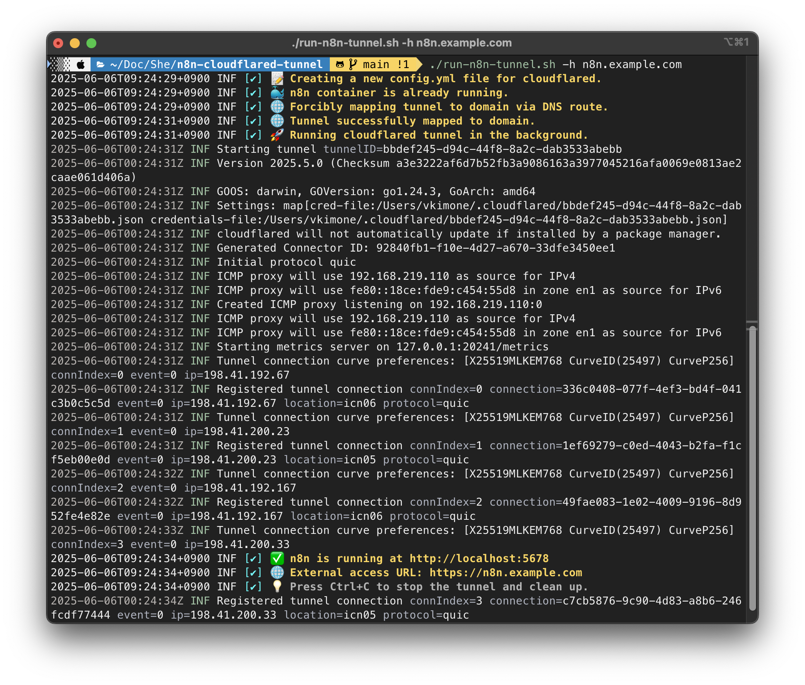

# n8n + Cloudflared Tunnel 자동화

이 저장소는 n8n(오픈소스 워크플로 자동화 툴)을 Cloudflare Tunnel과 Docker를 이용해 HTTPS로 외부에 안전하게 노출하는 자동화 셸 스크립트를 제공합니다.



## Cloudflared Tunnel을 사용하는 이유

Cloudflared Tunnel을 사용하면 로컬에서 실행 중인 n8n 서비스를 복잡한 방화벽이나 포트포워딩 없이도 Cloudflare의 글로벌 네트워크를 통해 안전하게 외부에 공개할 수 있습니다.

### 주요 장점
- **보안 강화**: 서버의 실제 IP를 노출하지 않고, Cloudflare의 보안 레이어를 그대로 활용할 수 있습니다.
- **간편한 HTTPS**: SSL 인증서 관리 없이도 자동으로 HTTPS가 적용됩니다.
- **방화벽/포트포워딩 불필요**: 별도의 네트워크 설정 없이도 외부에서 접근이 가능합니다.
- **DDoS 및 공격 방어**: Cloudflare의 DDoS 방어, WAF 등 다양한 보안 기능을 그대로 사용할 수 있습니다.
- **유연한 도메인 매핑**: 원하는 도메인으로 손쉽게 서비스 노출이 가능합니다.

이 스크립트는 Cloudflared Tunnel을 자동으로 설정하고, n8n 인스턴스를 안전하게 외부에 공개할 수 있도록 도와줍니다.

## 주요 기능
- Cloudflared tunnel 설정 파일(`config.yml`)을 자동 생성/업데이트
- n8n Docker 컨테이너가 없으면 자동 생성 및 유틸리티 툴(bash, curl, nano) 설치
- Cloudflare DNS를 통한 도메인 매핑 자동화
- 백그라운드에서 tunnel 실행 및 안전한 외부 노출
- 컬러풀한 로그와 Ctrl+C 시 안전한 종료
- 주요 환경변수 커맨드라인 옵션으로 오버라이드 지원

## 사전 준비사항
- Docker 설치 및 실행
- Cloudflared 설치 및 인증(`cloudflared tunnel login`)
- Cloudflare에서 관리하는 도메인과 tunnel 생성 ([Cloudflare Tunnel 문서](https://developers.cloudflare.com/cloudflare-one/connections/connect-apps/) 참고)
- tunnel용 credentials 파일(JSON)

### cloudflared 설치 (macOS)
Homebrew로 cloudflared를 설치할 수 있습니다:

```sh
brew install cloudflared
```

설치 후 Cloudflare 인증:

```sh
cloudflared tunnel login
```

## Alpine Linux 주의사항
**이 스크립트와 Dockerfile은 n8n 컨테이너가 Alpine Linux 기반임을 전제로 합니다.**
- 컨테이너 내부 유틸리티 설치는 `apk` 패키지 매니저를 사용합니다.
- Debian/Ubuntu 등 다른 베이스 이미지를 쓸 경우 설치 명령어(`apt-get` 등)를 직접 수정해야 합니다.
- 공식 `n8nio/n8n:latest` 이미지는 현재 Alpine 기반이지만, 향후 변경될 수 있습니다.

## 사용법

아래 커맨드라인 옵션으로 주요 환경변수를 오버라이드할 수 있습니다:

| 옵션 | 환경 변수 | 설명 |
|------|-----------|------|
| `-h` | `DOMAIN_NAME` | n8n을 노출할 도메인 |
| `-t` | `TUNNEL_NAME` | Cloudflare tunnel 이름 (기본값: `n8n-tunnel`) |
| `-c` | `CREDENTIALS_FILE` | tunnel credentials JSON 파일 경로 (기본값: `$HOME/.cloudflared/your-credentials.json`) |
| `-d` | `HOST_DATA_DIR` | n8n 데이터가 저장될 호스트 디렉토리 (기본값: `$HOME/Documents/Docker/n8n-data`) |
| `-n` | `CONTAINER_NAME` | Docker 컨테이너 이름 (기본값: `n8n`) |

### 예시

```sh
chmod +x run-n8n-tunnel.sh
./run-n8n-tunnel.sh -h your.domain.com -c /path/to/credentials.json -d /my/data/dir -n my-n8n-container
```

옵션을 생략하면 스크립트의 기본값이 사용됩니다.

### n8n 접속
- 로컬: [http://localhost:5678](http://localhost:5678)
- 외부: `https://<your-domain>`

### 중지
- 터미널에서 `Ctrl+C`를 눌러 안전하게 tunnel과 컨테이너를 종료할 수 있습니다.

## 동작 방식
- Cloudflared의 tunnel, credentials, ingress 규칙이 반영된 최신 `config.yml`을 항상 생성합니다.
- n8n Docker 컨테이너가 없으면 자동으로 생성하고, 유틸리티 툴도 설치합니다.
- tunnel과 도메인 간의 Cloudflare DNS 라우팅을 자동으로 설정합니다.
- tunnel을 백그라운드로 실행해 로컬 n8n 인스턴스를 안전하게 외부에 노출합니다.
- 모든 단계는 컬러와 타임스탬프가 포함된 로그로 출력되어 문제 해결이 쉽습니다.

## 커스터마이즈
- 스크립트 상단 변수 또는 CLI 옵션으로 도메인, tunnel 이름, 데이터 디렉토리, 컨테이너 이름을 변경할 수 있습니다.
- n8n의 고급 설정은 [n8n 공식 문서](https://docs.n8n.io/)를 참고하세요.

## [업데이트] 항상 최신 n8n 도커 이미지를 자동으로 pull

- 스크립트가 컨테이너를 시작하거나 재생성하기 전에 항상 최신 `n8nio/n8n:latest` 이미지를 자동으로 pull합니다.
- 별도의 수동 업데이트 없이 항상 최신 n8n 버전이 실행됩니다.
- 사용자는 추가로 신경 쓸 필요 없이 최신 환경을 바로 사용할 수 있습니다.

## 라이선스
MIT
