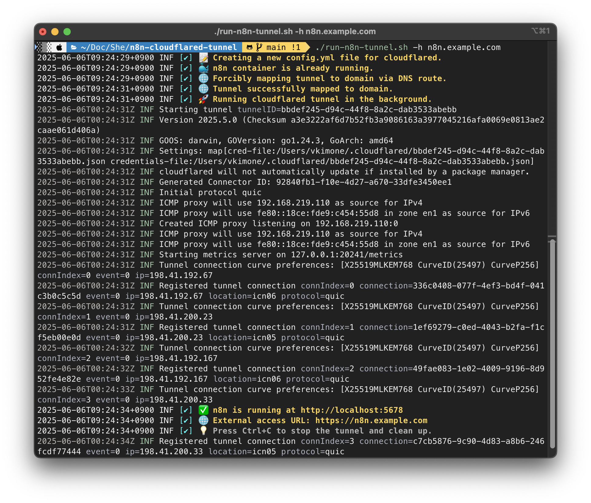

[🇰🇷 한국어 README 보기](README.ko.md)

# n8n + Cloudflared Tunnel Automation

This repository provides a shell script to automate the deployment of n8n (an open-source workflow automation tool) with a public HTTPS endpoint using Cloudflare Tunnel and Docker.



## Why use Cloudflared Tunnel?

Cloudflared Tunnel allows you to securely expose your locally running n8n service to the public internet. Without complex firewall or port forwarding settings, you can access your service safely via HTTPS through Cloudflare's global network.

### Key Advantages
- **Enhanced Security**: Your server's real IP is never exposed, and you benefit from Cloudflare's security layer.
- **Easy HTTPS**: HTTPS is automatically enabled without the need to manage SSL certificates.
- **No Firewall/Port Forwarding Needed**: No additional network configuration is required for external access.
- **DDoS & Attack Protection**: Leverage Cloudflare's DDoS protection, WAF, and other security features.
- **Flexible Domain Mapping**: Easily expose your service with any custom domain you own.

This script automates the setup of Cloudflared Tunnel and helps you securely expose your n8n instance to the outside world.

## Features
- Automatically creates or updates the Cloudflared tunnel config file (`config.yml`)
- Ensures the n8n Docker container is running (creates and initializes if needed)
- Installs utility tools (bash, curl, nano) in the n8n container on first run
- Maps a custom domain to the tunnel using Cloudflare DNS
- Runs the tunnel in the background and exposes n8n securely
- Colorful, timestamped logs and graceful shutdown on Ctrl+C
- Supports overriding key environment variables via command-line arguments

## [Update] Always Pull Latest n8n Docker Image

- The script now automatically pulls the latest `n8nio/n8n:latest` Docker image before starting or recreating the container.
- This ensures you always run the most up-to-date version of n8n without manual intervention.
- No additional action is required; the update is handled automatically within the script.

## Prerequisites
- Docker installed and running
- Cloudflared installed and authenticated (`cloudflared tunnel login`)
- A Cloudflare-managed domain and a tunnel created (see [Cloudflare Tunnel docs](https://developers.cloudflare.com/cloudflare-one/connections/connect-apps/))
- Credentials file for the tunnel (JSON)

### Install cloudflared (macOS)
If you don't have `cloudflared` installed, you can install it via Homebrew:

```sh
brew install cloudflared
```

After installation, authenticate with Cloudflare:

```sh
cloudflared tunnel login
```

## Alpine Linux Notice
**The Dockerfile and script assume the n8n container is based on Alpine Linux.**
- All utility installations inside the container use the `apk` package manager (Alpine standard).
- If you use a different base image (e.g. Debian/Ubuntu), you must adapt the installation commands (e.g. use `apt-get` instead of `apk`).
- The official `n8nio/n8n:latest` image is currently Alpine-based, but this may change in the future.

## Usage

You can override the following environment variables via command-line options:

| Option | Environment Variable | Description |
|--------|---------------------|-------------|
| `-h`   | `DOMAIN_NAME`       | The public domain to expose n8n |
| `-t`   | `TUNNEL_NAME`       | The name of the Cloudflare tunnel (default: `n8n-tunnel`) |
| `-c`   | `CREDENTIALS_FILE`  | Path to the Cloudflare tunnel credentials JSON file (default: `$HOME/.cloudflared/your-credentials.json`) |
| `-d`   | `HOST_DATA_DIR`     | Host directory for n8n persistent data (default: `$HOME/Documents/Docker/n8n-data`) |
| `-n`   | `CONTAINER_NAME`    | Docker container name (default: `n8n`) |

### Example

```sh
chmod +x run-n8n-tunnel.sh
./run-n8n-tunnel.sh -h your.domain.com -c /path/to/credentials.json -d /my/data/dir -n my-n8n-container
```

If you omit any option, the script will use its default value.

### Access n8n
- Local: [http://localhost:5678](http://localhost:5678)
- Public: `https://<your-domain>`

### Stop
- Press `Ctrl+C` in the terminal to gracefully stop the tunnel and clean up.

## How it works
- The script always creates a fresh `config.yml` for Cloudflared with the correct tunnel, credentials, and ingress rules.
- It checks for the n8n Docker container. If missing, it creates one and installs useful tools inside.
- It ensures the Cloudflare DNS route is set up between the tunnel and your domain.
- It runs the tunnel in the background, exposing your local n8n instance to the public internet securely.
- All steps are logged with color and timestamps for easy troubleshooting.

## Customization
- You can change the domain, tunnel name, data directory, or container name by editing the variables at the top of the script or passing them as CLI arguments.
- For more advanced n8n configuration, see the [n8n documentation](https://docs.n8n.io/).

## License
MIT
